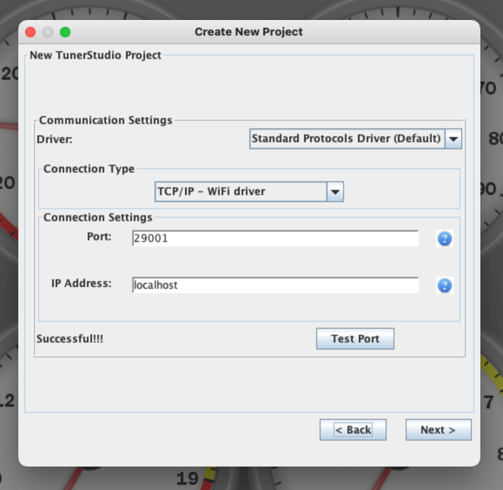

# FOME Simulator in Docker

It's just a [FOME firmware](https://github.com/FOME-Tech/fome-fw) simulator, but cross-platform.

## Running

```bash
docker compose up
```

## Using TCP

Docker container exposes TCP ports `29001` and `29002`.

Verify TCP connection:

```bash
telnet localhost 29001
```

```logs
Trying ::1...
Connected to localhost.
Escape character is '^]'.
```

Docker logs:

```logs
...
fome-simulator-docker-sim-1  | Init: connection on SD1
```

### TS Setup



## Using Virtual Serial Port

### Linux

Install [socat](http://www.dest-unreach.org/socat/).

Bind TCP to virtual serial port:

```bash
socat pty,link=/dev/virtualcom0,raw tcp:localhost:29001
```

### macOS

Does not work on macOS, because of *System Integrity Protection*. Must use TCP instead.

## TODO

- [ ] Add FOME release `bundle` as a volume once the Linux binary is there

## Issues

CPU usage is always 100%, wtf?
